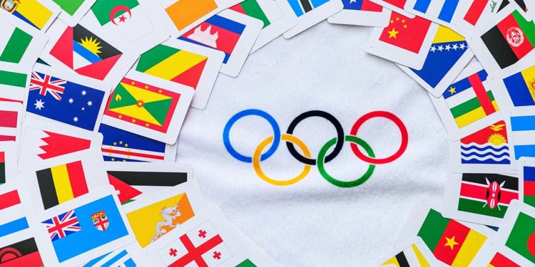

# The Olympics Data Analysis

## Objective
A group project for visualization of olympic data from Kaggle.

## Team Members
Charissa Hoxie 
Toshi Torihara 
Michael Farm 

## Tools Used
`Python`
`Pandas`
`Matplotlib`

## Data Source
120 years of Olympic history: athletes and results 
https://www.kaggle.com/chadalee/olympics-data-cleaning-exploration-prediction/data

## Table of Contents
[How certain aspects of Olympics have changed over the years and affected medal counts](olympics.pptx)
* Data used and cleaning
* Medals won by age group
* Number of athletes participation over the year
* Male vs female participation change over the years
* Medals won by countries
* Number of events by year
* US medals vs the other regions

